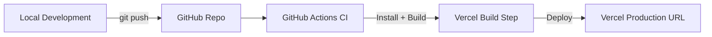

# 🌌 Celestial Portfolio

An **interactive 3D portfolio** built with **Next.js, React Three Fiber, and TailwindCSS**.  
Projects are represented as celestial bodies floating in a dynamic starfield.  

## 🚀 Features
- Immersive **3D starfield scene**
- Interactive project nodes with tooltips
- Smooth transitions and animations with **Framer Motion**
- **Responsive** design for desktop and mobile
- Modular architecture for easy extension

## 📂 Project Structure
- `src/app` – Next.js App Router pages
- `src/components` – UI + 3D components
- `src/data` – Project data definitions
- `src/stores` – Global state with Zustand
- `src/hooks` – Custom React hooks
- `src/utils` – Helper functions
- `docs/` – Documentation (includes full [Blueprint](docs/BLUEPRINT.md))

## 🛠️ Development
```bash
npm install
npm run dev
```
Then visit [http://localhost:3000](http://localhost:3000).

## 🏗️ Production
```bash
npm run build
npm start
```

## 📘 Documentation
See the full [Blueprint](docs/BLUEPRINT.md) for technical details, project phases, and QA plan.

## ☁️ Deployment (Vercel)
This project is set up with **GitHub Actions + Vercel** for continuous deployment.

### Steps to enable:
1. Go to **Vercel → Account Settings → Tokens** and create a new **token**.
2. In your GitHub repo:  
   - Navigate to **Settings → Secrets and variables → Actions**  
   - Add a new secret named **`VERCEL_TOKEN`** with the token you generated.
3. Push to the `main` branch.  
   GitHub Actions will:  
   - ✅ Pull Vercel project settings  
   - ✅ Build the Next.js app  
   - ✅ Deploy automatically to Vercel  

After the first successful run, your app will be live on Vercel 🎉

### 🔄 Deployment Flow Diagram


### 🏛️ Project Architecture
```mermaid
flowchart TD
    A[User] -->|interacts with| B[UI Components]
    B --> C[3D Scene (React Three Fiber)]
    B --> D[State Management (Zustand)]
    D --> E[Hooks & Utils]
    C --> F[Project Data]
    D --> F
    F --> B
```

For details, see [docs/ARCHITECTURE.md](docs/ARCHITECTURE.md).

Also see [docs/TIMELINE.md](docs/TIMELINE.md) for the full project Gantt chart.
See [docs/CODE_STRUCTURE.md](docs/CODE_STRUCTURE.md) for the module/class diagram.
Check [docs/DATA_MODEL.md](docs/DATA_MODEL.md) for the ERD (data relationships).
See [docs/SEQUENCE.md](docs/SEQUENCE.md) for the user interaction flow.
Check [docs/STATE.md](docs/STATE.md) for the application state diagram.
See [docs/WORKFLOW.md](docs/WORKFLOW.md) for the developer workflow.
Check [docs/CICD.md](docs/CICD.md) for the CI/CD pipeline.
See [docs/INFRA.md](docs/INFRA.md) for the infrastructure diagram.
Check [docs/COMPONENT.md](docs/COMPONENT.md) for the React component diagram.
See [docs/JOURNEY.md](docs/JOURNEY.md) for the user journey.
View [docs/SITEMAP.md](docs/SITEMAP.md) for the sitemap.

---

## 🔑 Environment Variables
This project includes **example environment files**:

- `.env.local.example` → local development  
- `.env.production.example` → production deployment  

To use them:
1. Copy the example file and rename it:  
   ```bash
   cp .env.local.example .env.local
   ```
2. Edit values as needed (e.g., API URLs, feature flags).  
3. For production, add these variables in **Vercel → Project Settings → Environment Variables**.  

---
**Author:** Project generated with AI assistance  
