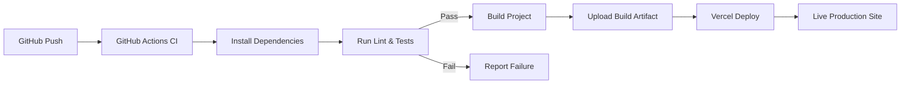

# 🚀 CI/CD Pipeline (Mermaid Diagram)

This diagram shows the continuous integration and deployment flow.

## 🔎 Explanation
- A push to **GitHub** triggers **GitHub Actions**.  
- Dependencies are installed, linting & tests run.  
- On success, the project is built and artifacts uploaded.  
- Vercel deploys the latest build to production automatically.  
