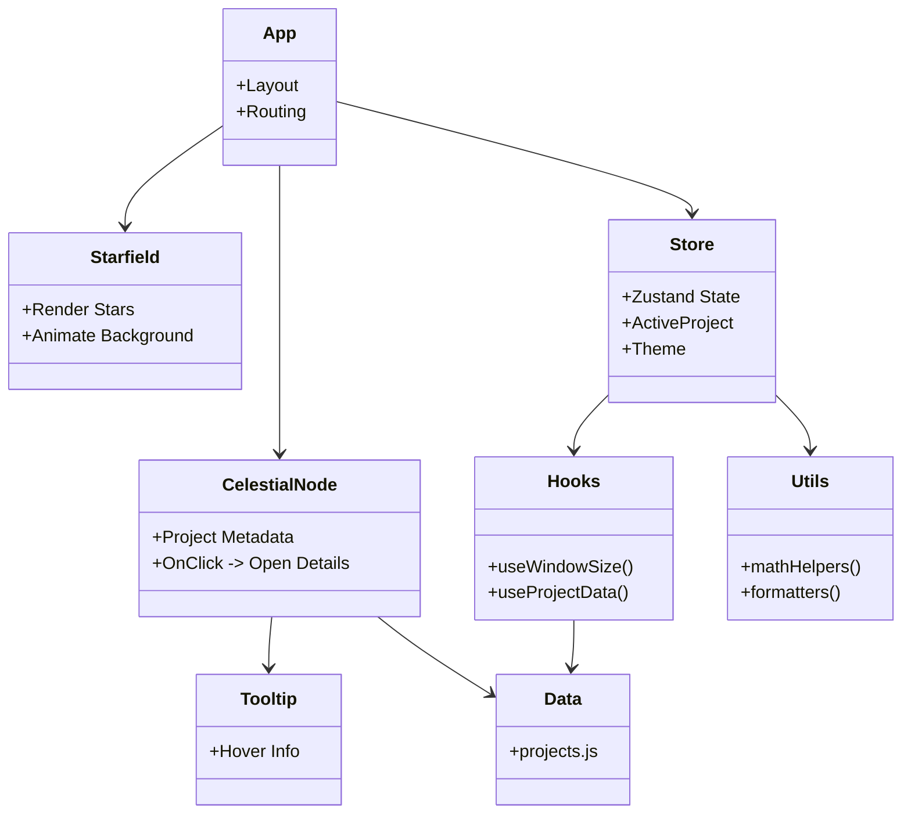

# 🧩 Code Structure (Class Diagram)

This diagram shows the relationships between key modules in the Celestial Portfolio.

## 🔎 Explanation
- **App** is the root, connecting layout, starfield, and celestial nodes.  
- **Starfield** handles background rendering.  
- **CelestialNode** maps to project data and user interactions.  
- **Store** manages global state with Zustand.  
- **Hooks** connect state + utilities to components.  
- **Data** feeds content into nodes and UI.  
