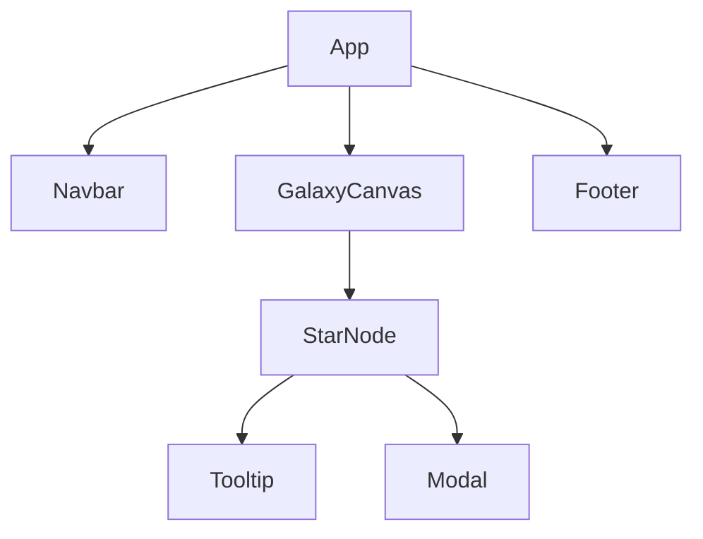

# ⚛️ React Component Diagram (Mermaid)

This diagram shows the main React components and their relationships.

## 🔎 Explanation
- **App** is the root component.  
- **Navbar** and **Footer** are always visible.  
- **GalaxyCanvas** renders the 3D space with interactive stars.  
- **StarNode** represents each project/star.  
- **Tooltip** shows hover previews, while **Modal** shows full project details.  
