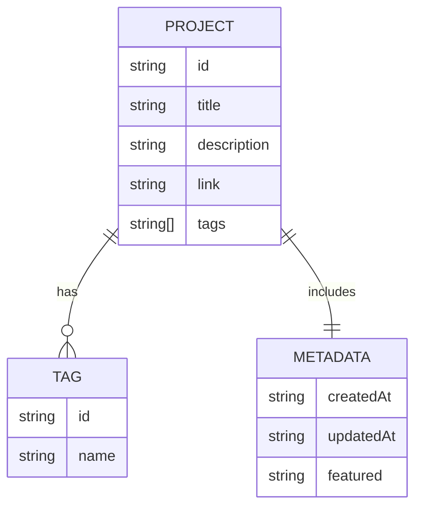

# 🗄️ Data Model (Entity-Relationship Diagram)

This diagram shows how project-related data entities connect.

## 🔎 Explanation
- **Project** is the central entity, containing metadata and referencing tags.  
- **Tags** allow categorization and filtering.  
- **Metadata** holds creation/update timestamps and special flags (e.g., featured).  
