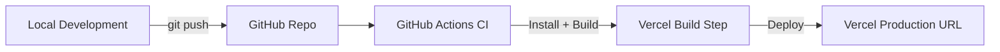

# 🚀 Deployment Flow

This document explains how code moves from local development to live production on Vercel.

## 🔄 Steps in the Flow
1. **Local Development** – Work on features locally using Next.js dev server.
2. **Push to GitHub** – Commit and push changes to the `main` branch.
3. **GitHub Actions CI** – Runs automated checks and triggers Vercel deploy.
4. **Vercel Build Step** – Builds optimized production bundle.
5. **Vercel Production URL** – Deployment goes live automatically.

---
This ensures **continuous deployment**: every push to `main` goes live with no manual steps.
