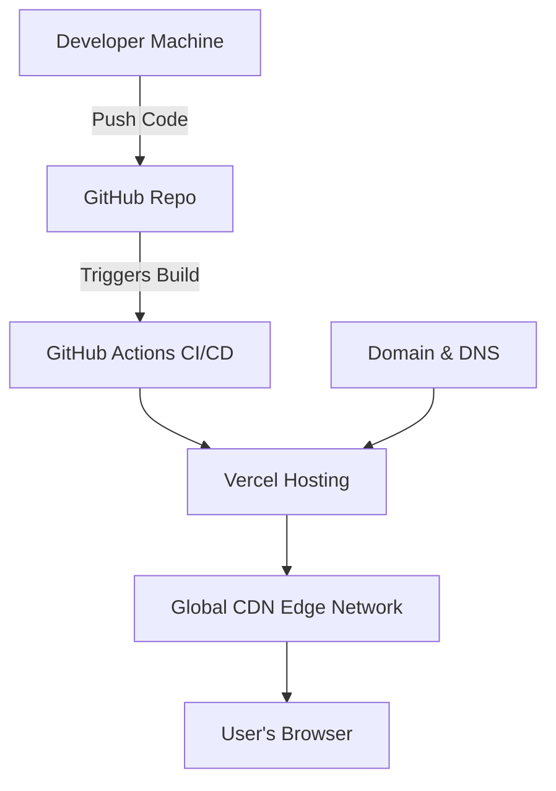

# 🌐 Infrastructure Diagram (Mermaid)

This diagram shows the hosting and delivery infrastructure for Celestial Portfolio.

## 🔎 Explanation
- **Developer Machine** pushes code to **GitHub**.  
- **GitHub Actions** runs CI/CD pipelines.  
- **Vercel** handles builds and deployments.  
- **DNS** routes traffic to Vercel.  
- **Vercel’s CDN** serves optimized assets globally to the **user’s browser**.  
