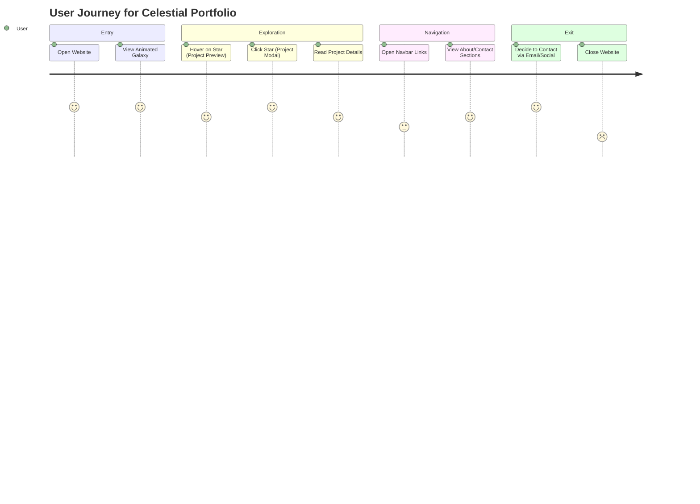

# 🧭 User Journey Diagram (Mermaid)

This diagram illustrates the flow of how a visitor interacts with the Celestial Portfolio.

## 🔎 Explanation
- Visitors **enter** via homepage and see the **galaxy animation**.  
- They **explore** by hovering and clicking stars to view projects.  
- They **navigate** via the navbar to read more sections.  
- Finally, they may **exit** after contacting or browsing projects.  
