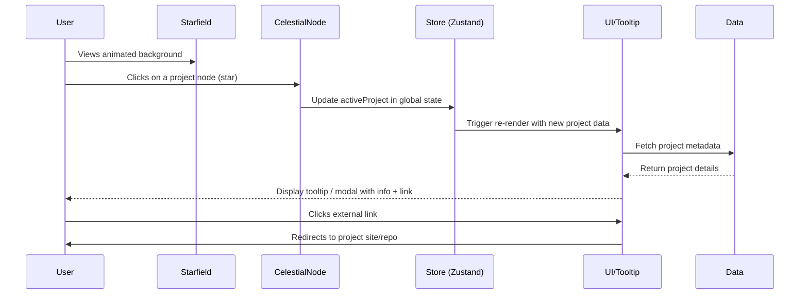

# 🖱️ User Interaction Flow (Sequence Diagram)

This diagram shows what happens when a user interacts with the portfolio.

## 🔎 Explanation
- User starts by interacting with a **CelestialNode** (project star).  
- The **Store** updates global state (`activeProject`).  
- UI components (like tooltips/modals) re-render and fetch the relevant **Data**.  
- Finally, the user can open external project links.  
