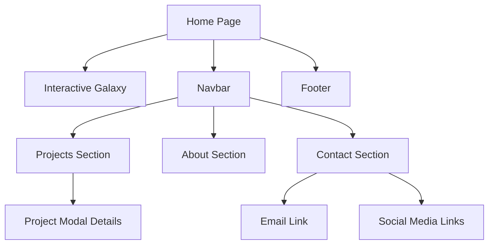

# 🗺️ Sitemap Diagram (Mermaid)

This diagram shows the hierarchy of pages and sections in the Celestial Portfolio.

## 🔎 Explanation
- **Home Page** contains the galaxy visualization and global navigation.  
- **Navbar** links to **Projects**, **About**, and **Contact**.  
- **Projects** lead to **modals** with details.  
- **Contact** has **email** and **social links**.  
- **Footer** is always visible.  
