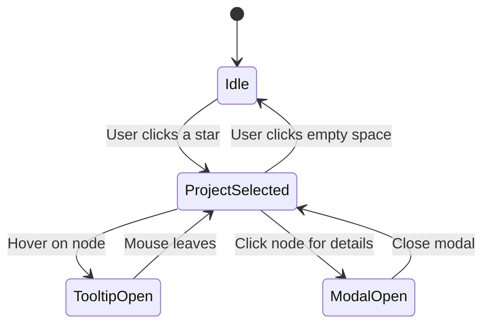

# 🔄 Application State Flow (State Diagram)

This diagram shows how the Celestial Portfolio transitions between states.

## 🔎 Explanation
- **Idle**: No active selection.  
- **ProjectSelected**: A celestial node is active in the global state.  
- **TooltipOpen**: Hover state for preview info.  
- **ModalOpen**: Full detail view of the project.  
- State resets to **Idle** if the user clicks outside.  
