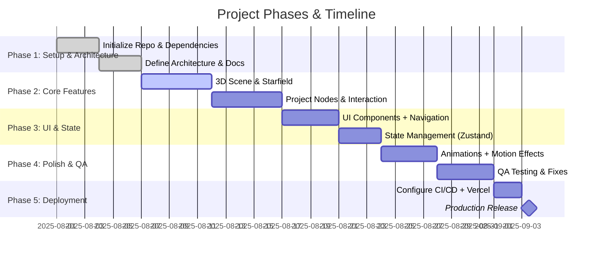

# 📅 Project Timeline (Gantt Chart)

This chart shows the planned phases of development for the Celestial Portfolio.

## 🔄 Notes
- Dates are **illustrative** — adjust for your actual schedule.
- Each phase builds on the previous one.
- Continuous deployment ensures each push can be tested on Vercel.
