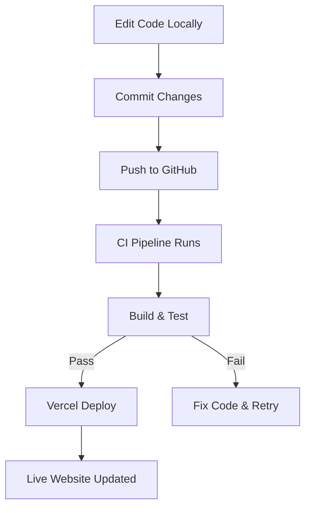

# 🛠️ Developer Workflow (Flowchart)

This diagram shows the development & deployment pipeline.

## 🔎 Explanation
- Developers edit code locally and commit.  
- Code is pushed to **GitHub**, triggering CI checks.  
- If tests/builds pass, **Vercel** auto-deploys.  
- Failures loop back into fixing and retrying.  
